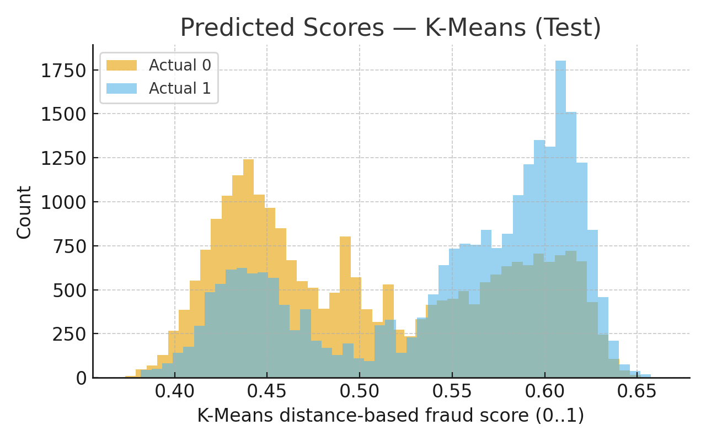

### 4.1 Quantitive Metrics

For this project, we’ll be using several metrics to evaluate our models. We focus on precision, recall, and F1-score, since precision shows how many flagged cases are true fraud, while recall measures coverage of actual fraud cases. F1 balances the two. Finally, the ROC-AUC curve will show how the true positive rate varies with the false positive rate across different thresholds, helping us assess the model’s overall discriminative power and robustness.

### 4.2 Project Goals

The objective is to maximize recall while maintaining strong overall classification performance. A practical target is recall above 95% with precision around 90–95%. While perfect recall and precision are unlikely, a strong F1-score (>0.92) indicates good balance. An ROC-AUC in the 0.8–0.9 range would confirm solid discriminative ability across thresholds. Beyond metrics, the system should remain fair across customer groups, respect privacy constraints, and operate efficiently in real time.

### 4.3 Expected Results

We expect Random Forests and Gradient Boosting to deliver strong results, with recall and precision in the 90–95% range. F1-scores will likely land between 0.92 and 0.94, reflecting strong balance. ROC-AUC is expected in the 0.8–0.9 range, indicating robust discriminative ability across thresholds. While the exact targets (e.g., 99% recall) may not be reached, the models should still provide a powerful fraud detection tool that significantly reduces fraud while minimizing disruptions.

### 4.4 Logistic Regression Results and Analysis

For our supervised model, we created a logistic regression model, outputting the probability a given transaction is fraudulent. We created two major models, one using the features from the original dataset, and one with the features from our PCA algorithm. Their results are below:

#### **Regression on Original Features**

**[RESULTS] Logistic Regression (Lightweight)**  

| Class | Precision | Recall | F1-Score | Support |
|:------|:----------:|:-------:|:---------:|:--------:|
| **0** | 0.9886 | 0.8316 | 0.9033 | 113,975 |
| **1** | 0.1366 | 0.7346 | 0.2304 | 4,133 |
| **Accuracy** |  |  | **0.8283** | 118,108 |
| **Macro Avg** | 0.5626 | 0.7831 | 0.5669 | 118,108 |
| **Weighted Avg** | 0.9587 | 0.8283 | 0.8798 | 118,108 |

**ROC AUC:** `0.8639`  

#### **Regression on PCA Features**

**[RESULTS] Logistic Regression on PCA Features**  

| Class | Precision | Recall | F1-Score | Support |
|:------|:----------:|:-------:|:---------:|:--------:|
| **0** | 0.9855 | 0.7598 | 0.8581 | 113,975 |
| **1** | 0.0947 | 0.6925 | 0.1666 | 4,133 |
| **Accuracy** |  |  | **0.7575** | 118,108 |
| **Macro Avg** | 0.5401 | 0.7262 | 0.5123 | 118,108 |
| **Weighted Avg** | 0.9544 | 0.7575 | 0.8339 | 118,108 |

**ROC AUC:** `0.8027`  

From the above statements we are able to learn a lot about how our 2 models performed. For starters, the ROC AUC is a summary metric, telling us how well our model does in general, amongst the entire data set. From this, we see our model that uses the PCA features generates more error than the model that is trained on the original features. This tells us we need to look further into our PCA algorithm, or maybe that we should not be performing PCA, and each feature in the dataset is valuable.

The above graphs show a confusion matrix of each of our models, showing how the model predicted fraudulent and nonfraudulent transactions. For the majority of data points, the model behaved well. However, out of roughly 118,000 transactions, the model let 1,097 and 1,271 fraudulent transactions through ourmodel that used the original features and our PCA features, respectively. This equates to roughly 0.01% of all of our transactions making it past our model and turn out to be fraudulent. Depending on the real world implications, or company we decided to work with for this problem, we could tweak this number to better serve client needs.  

The above graph is a precision recall curve, plotting the recall values (fraction of actual fraudulent transactions being detected) against the precision values (fraction of predicted frauds that are truly fraud). It shows what the precision values are for all of the different recall values. The AP value stands for average precision, which is mathematically calculated as the area under the curve, but conceptually it represents how precise our model is, while we try to catch more and more fraudulent transactions. The lower AP in our PCA curve tells us that when we try to increase the number of fraudulent transactions caught, this will also increase the number of false positives, which in our scenario could be very costly. A transaction labeled as fraud when it is not, could result in many unhappy customers, frustrated that their transactions are not going through.

The graph above is going to be very helpful in helping us continue to check the number of false positives as we continue to increase the number of fraudulent transactions flagged. As we continue to tweak our model, we will continue to review this chart, and hope to improve our AP scores. An AP score of 0.43 on our orignial model is not terrible given the dataset and the small number of fraudulent transactions we have to work with, yet we still want to improve that number to around 0.6 to ensure we increase correct fraudulent labels. 

<table>
  <tr>
    <td></td>
    <td></td>
  </tr>
  <tr>
    <td align="center">Original Features</td>
    <td align="center">PCA Features</td>
  </tr>
</table>

The above chart is a histogram, showing the distribution of fraudulent and non fraudulent transactions in the dataset, as well as their predicted probability of how likley the transaction was fraudulent. Given the above graph we first see the count in true fraudulent transactions arise around a probability of 0.1, and increase around 0.4. For our first logistic regression model, we chose a simple threshold of 0.5 to determine what transactions would be classified as fraudulent or not. In a real world scenario, we would likely lower that threshold as we want less fraud to be getting through our model. Fraudulent transactions result in huge losses to customers, so it would be better for a bank or financial institution to flag more activity as fraud in order to avoid as much fraud as possible. 

#### Analysis

Given the above visualization on our model, our model provides adequate results to generate a baseline result for predicting fraudulent transactions or not. By using our threshold of 0.50 on our logistic regression model, almost a quarter of the fraudulent transactions are getting through our model and labeled as not fraud. This is definelty an area of our model that needs improvement. While the dataset only has around 4,000 fraudulent transactions available to us to train on, we still wish to stop more fraudulent transactions, and plan to work on this throughout the semester. 

#### Next Steps

Given the state of our model, there are a few steps we can take to look to improve our model. For starters, as mentioned previously we selected a simple 50% threshold to classify a transaction as fraud. While for most scenarios this may be the best value to choose, for this scenario we may want to lower the threshold to classify more variables as fraudulent. Most banks and financial institutions want to ensure they stop as much fraud as possible. For our model, this may come at the cost of mislabeling transactions as fraudulent when they are not, but as a whole we would get fewer false negatives, and would save bank customers lots of money and stress from being fraud victims. We will begin expierementing with this number, to try to reduce the total number of fraudulent transactions getting 'past' the model. Aside from the threshold, we can reexamine our PCA analysis, as the overall accuracy of the model decreased by training on PCA. While this is typical in PCA, we will expierement with getting more features from PCA, and seeing how our accuracy changes. Given we are just running the model locally, we can test adding more PCA features, even though it will increase the model's execution power. 

For a more in depth look at the code generating these images, look into the logistic_regression_analysis notebook file. 

### 4.5 Neural Network (Supervised) Results and Analysis

To make a more advanced supervised model, we architected a neural network, called FraudNet. We created two major models, one using the features from the original dataset, and one with the features from our PCA algorithm. Their results are below:

**[RESULTS] FraudNet (Full Model)**  

| Class | Precision | Recall | F1-Score | Support |
|:------|:----------:|:-------:|:---------:|:--------:|
| **0** | 0.9909 | 0.8608 | 0.9213 | 113,975 |
| **1** | 0.1694 | 0.7830 | 0.2785 | 4,133 |
| **Accuracy** |  |  | **0.8580** | 118,108 |
| **Macro Avg** | 0.5802 | 0.8219 | 0.5999 | 118,108 |
| **Weighted Avg** | 0.9622 | 0.8580 | 0.8988 | 118,108 |

**ROC AUC:** `0.9007`  

#### **FraudNet on PCA Features**

**[RESULTS] FraudNet (PCA Model)**  

| Class | Precision | Recall | F1-Score | Support |
|:------|:----------:|:-------:|:---------:|:--------:|
| **0** | 0.9897 | 0.8348 | 0.9056 | 113,975 |
| **1** | 0.1429 | 0.7595 | 0.2405 | 4,133 |
| **Accuracy** |  |  | **0.8321** | 118,108 |
| **Macro Avg** | 0.5663 | 0.7971 | 0.5731 | 118,108 |
| **Weighted Avg** | 0.9600 | 0.8321 | 0.8824 | 118,108 |

**ROC AUC:** `0.9007`  

#### Confusion Matrices

To visualize performance, we plotted confusion matrices for both models.

<table>
  <tr>
    <td></td>
    <td></td>
  </tr>
  <tr>
    <td align="center">Original Features</td>
    <td align="center">PCA Features</td>
  </tr>
</table>

These matrices show that the Full Model misclassifies fewer fraudulent transactions than the PCA model, consistent with the metrics reported above.

#### ROC Curves

Both models’ ROC curves can be plotted on the same figure for comparison:

The ROC curves confirm that the Full Model consistently achieves higher true positive rates at the same false positive rates compared to the PCA Model.

#### Precision-Recall Curve

The precision-recall curve shows the trade-off between precision and recall across different thresholds. It illustrates how well the model identifies fraudulent transactions while minimizing false positives.

#### Analysis

FraudNet outperforms logistic regression overall, especially in ROC AUC. The Full Model using original features achieves higher recall and F1-score for fraudulent transactions, capturing more fraud while keeping false positives relatively low. The PCA model performs slightly worse, suggesting that dimensionality reduction may discard important information. The confusion matrices and precision-recall curve confirm these differences, showing the Full Model maintains higher precision across most recall values. Given the severe real-world consequences of undetected fraud, these results highlight the importance of carefully considering which features to include. Overall, FraudNet demonstrates the benefit of a non-linear neural network approach over a linear model.

#### Next Steps

To further improve FraudNet performance, we plan to:

1. **Experiment with threshold tuning** – lowering the probability threshold for classifying fraud to reduce false negatives.

2. **Adjust the network architecture** – explore deeper layers or different hidden sizes to capture more complex patterns.

3. **Incorporate additional regularization or dropout** – to improve generalization without losing predictive power.

### 4.6 K-Means (Unsupervised) Results and Analysis

To separate fraud from non fraud we set k=2 and evaluate how K Means performs on the engineered features in Section 3.1. To avoid overwhelming the clustering with very high dimensional signals, we exclude the electronic footprint features V1–V339. After feature engineering the data were imbalanced at about 10:1 non fraud to fraud, so we applied data augmentation to balance the train and test splits. Because K Means is label free, we fit on the train split, map clusters to classes (isFraud ∈ {0,1}) by majority vote on the training labels, and apply that mapping to both splits. The findings for training and testing are reported below.

---

#### [RESULTS] K Means ⇒ Majority Label (Train)

| Class | Precision | Recall | F1 Score | Support |
|:--|:--:|:--:|:--:|--:|
| 0 (Non fraud) | 0.6657 | 0.5259 | 0.5876 | 74,976 |
| 1 (Fraud)     | 0.6082 | 0.7359 | 0.6660 | 74,976 |
| Accuracy |  |  | 0.6309 | 149,952 |
| Macro Avg | 0.6369 | 0.6309 | 0.6268 | 149,952 |
| Weighted Avg | 0.6369 | 0.6309 | 0.6268 | 149,952 |

#### [RESULTS] K Means ⇒ Majority Label (Test)

| Class | Precision | Recall | F1 Score | Support |
|:--|:--:|:--:|:--:|--:|
| 0 (Non fraud) | 0.6643 | 0.5288 | 0.5888 | 24,992 |
| 1 (Fraud)     | 0.6086 | 0.7327 | 0.6649 | 24,992 |
| Accuracy |  |  | 0.6308 | 49,984 |
| Macro Avg | 0.6365 | 0.6308 | 0.6269 | 49,984 |
| Weighted Avg | 0.6365 | 0.6308 | 0.6269 | 49,984 |

Train and test behave similarly, so the unsupervised pipeline does not appear to overfit. In both splits the fraud class has recall about 0.73 and precision about 0.61. This means many frauds are caught with more false alarms. False negatives are lower. Overall accuracy is about 0.631.

---

#### Precision and recall behavior (score distributions)

We convert distance to centroid into a normalized fraud score in [0,1]. Larger values indicate more anomalous behavior. The histograms show that frauds shift toward higher anomaly scores, but there is still large overlap, which explains moderate precision at high recall.

---

#### Internal cluster quality measures (label free)

We report Silhouette (↑), Calinski–Harabasz (↑), Davies–Bouldin (↓), and BetaCV (↓) on standardized features for train and test. All metrics are plotted on one linear axis.

---

#### Analysis

K Means did not work fine in this setting. It is a centroid based method that best separates roughly circular or spherical clusters. Our data likely have a more complex and non spherical distribution. This explains the higher false positives and false negatives seen in the confusion matrices and the internal measures. Silhouette is low, DB and BetaCV are higher, and CH is only modest. These patterns indicate overlapping clusters rather than clean separation. K Means should be used as a baseline or as a feature generator and early filter, not as a standalone fraud detector.

#### Next steps

We will test k greater than 2 with stable k means++ restarts and sanity checks across resamples such as ARI and NMI. We will try dimensionality reduction such as PCA or UMAP before clustering. We will also evaluate Gaussian Mixture Models and DBSCAN or HDBSCAN to capture non spherical structure. Finally, we will feed distance to centroid scores into the supervised model and calibrate thresholds to control the false positive rate while monitoring centroid drift and internal measures over time.

## 5. Comparison of Models

Across all three models, the supervised approaches—Logistic Regression and FraudNet—clearly outperformed the unsupervised K-Means baseline. Logistic Regression on the original features provided a reasonable linear baseline with an ROC-AUC of 0.86 and a PR-AUC of about 0.43. However, it struggled to identify fraud consistently, missing over a thousand fraudulent transactions and achieving a relatively weak fraud F1-score. When trained on PCA-reduced features, its performance dropped across all major metrics, confirming that PCA removed meaningful structure that the linear model relied on.

FraudNet, the neural network, delivered the strongest overall performance. Using the full feature set, it reached an ROC-AUC of 0.90 and a higher PR-AUC of roughly 0.55, indicating better ranking and separation between fraud and non-fraud. It also produced higher fraud recall (around 78%) and a noticeably stronger fraud F1-score than Logistic Regression, demonstrating that a nonlinear architecture captures fraud patterns that the linear model cannot. Like Logistic Regression, the PCA version of FraudNet underperformed the full model, reinforcing that dimensionality reduction removed informative signals.

K-Means, the unsupervised model, performed the weakest. After mapping clusters to labels, it achieved only 63% accuracy with fraud precision around 61% and recall around 73%, indicating substantial overlap between clusters and high false-positive rates. Its internal clustering metrics also showed poor separation, confirming that fraudulent transactions do not form clean geometric clusters that K-Means can detect.

Overall, FraudNet is the strongest model, providing the best balance of precision, recall, and ranking performance. Logistic Regression serves as a solid interpretable baseline but struggles with the complexity of fraud data, while K-Means should be viewed mainly as an exploratory or supportive tool rather than a standalone fraud detection method.

