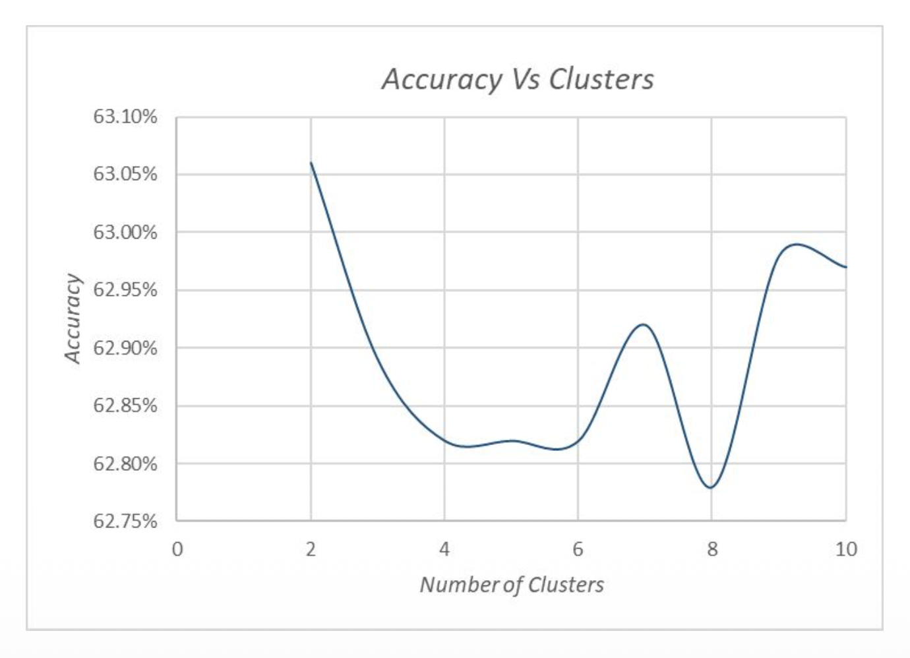
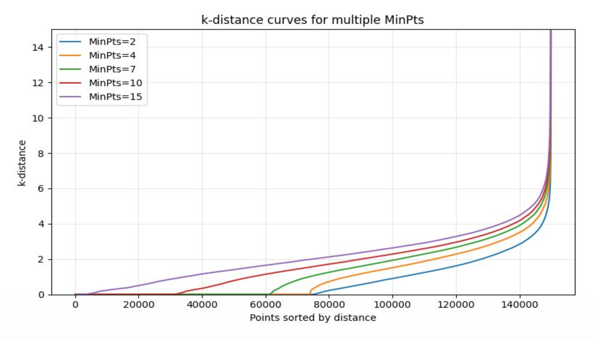
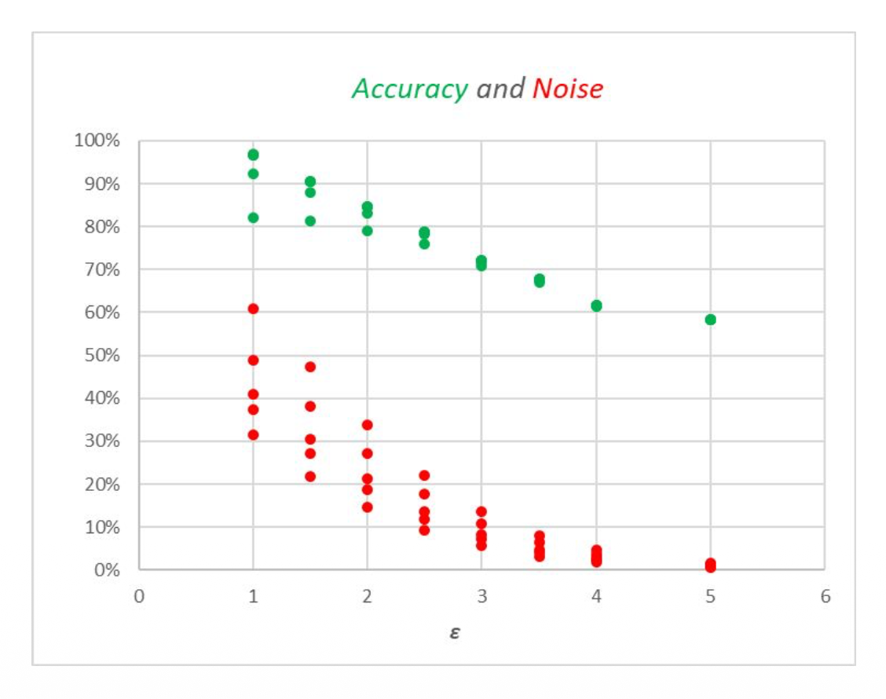
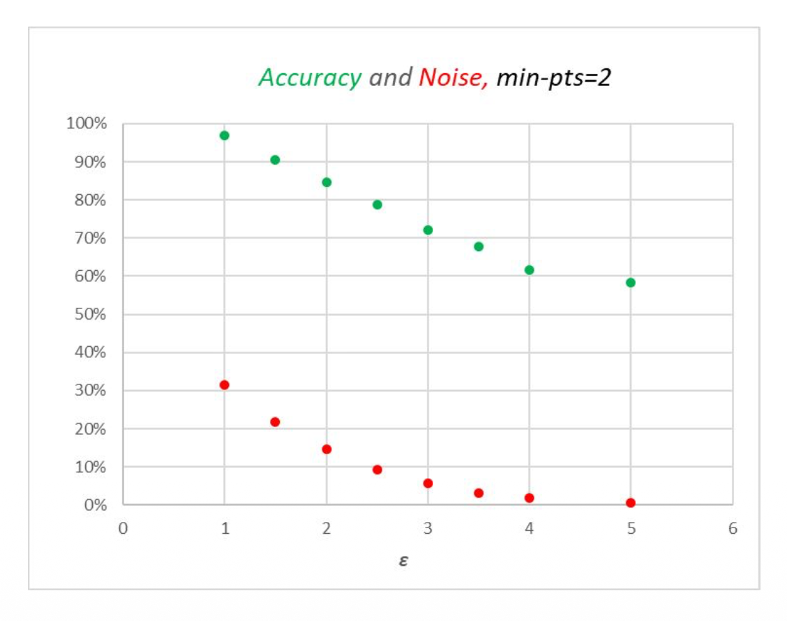

### 4.1 Quantitative Metrics

For this project, we prioritize metrics that effectively evaluate fraud detection performance, specifically focusing on the trade-off between catching fraud and minimizing false alarms.

* **Precision:** The percentage of flagged transactions that are truly fraudulent (minimizing false alarms).
* **Recall:** The percentage of actual fraud cases caught by the model (avoiding missed fraud).
* **F1-Score:** The harmonic mean of precision and recall, providing a single metric for balance.
* **PR-AUC:** The area under the Precision-Recall curve, which is robust for imbalanced datasets.
* **ROC-AUC:** Measures the overall discriminative power across various thresholds.

### 4.2 Project Goals

Our objective is to maximize recall to ensure fraudulent transactions are caught, while maintaining reasonable precision to avoid blocking legitimate customers.

* **Recall:** 99% (Catch almost all fraud)
* **Precision:** 95% (Minimize false positives)
* **F1-Score:** 95% (Strong balance)
* **PR-AUC:** High scores indicating robust performance across thresholds.
* **Constraints:** The system must remain fair across customer groups and operate efficiently in real-time.

### 4.3 Expected Results

Based on initial research, we anticipate the following performance ranges for our supervised models:

* **Recall:** 90–95%
* **Precision:** 90–95%
* **F1-Score:** 0.92–0.94
* **ROC-AUC:** > 0.85
* **Overall:** A strong fraud detection system that significantly reduces financial loss while minimizing disruptions for genuine users.

### 4.4 Logistic Regression Results and Analysis

As a baseline supervised model, we implemented **Logistic Regression**, creating two variations: one trained on the **Original Features** and one on **PCA Features**.

#### **[RESULTS] Logistic Regression Evaluation**

**1. Regression on Original Features**

| Class | Precision | Recall | F1-Score | Support |
|:---|:---:|:---:|:---:|:---:|
| **0 (Non-Fraud)** | 0.9886 | 0.8316 | 0.9033 | 113,975 |
| **1 (Fraud)** | **0.1366** | **0.7346** | **0.2304** | 4,133 |
| **Accuracy** | | | **0.8283** | 118,108 |
| **ROC AUC** | | | **0.8369** | |

**2. Regression on PCA Features**

| Class | Precision | Recall | F1-Score | Support |
|:---|:---:|:---:|:---:|:---:|
| **0 (Non-Fraud)** | 0.9855 | 0.7598 | 0.8581 | 113,975 |
| **1 (Fraud)** | **0.0947** | **0.6925** | **0.1666** | 4,133 |
| **Accuracy** | | | **0.7575** | 118,108 |
| **ROC AUC** | | | **0.8027** | |

#### Confusion Matrices & Curves

The confusion matrices show that while the model correctly identifies the majority of transactions, it allows a significant number of fraudulent transactions to pass through (High False Negatives).

The Precision-Recall curve highlights the trade-off. The lower AP (Average Precision) for the PCA model confirms that dimensionality reduction resulted in information loss, reducing the model's ability to distinguish fraud effectively.

#### Predicted Probabilities

<table>
  <tr>
    <td></td>
    <td></td>
  </tr>
  <tr>
    <td align="center">Original Features</td>
    <td align="center">PCA Features</td>
  </tr>
</table>

The histograms show the distribution of predicted probabilities. We used a default threshold of 0.5. Lowering this threshold could improve recall (catching more fraud) but would likely increase false positives.

#### Analysis

Logistic Regression served as a functional baseline. With an ROC-AUC of **0.8369**, it demonstrated reasonable predictive power. However, the PCA-based model performed worse across all metrics (Accuracy dropped to 75.75%), suggesting that PCA removed features critical for linear separation. The low F1-score for the fraud class (0.2304) indicates that a linear model is insufficient for the complex patterns of credit card fraud.

### 4.5 Neural Network (Supervised) Results and Analysis

To capture non-linear relationships, we developed a neural network architecture called **FraudNet**. Similar to the baseline, we evaluated it on both Original and PCA features.

#### **[RESULTS] FraudNet Evaluation**

**1. FraudNet on Original Features (Full Model)**

| Class | Precision | Recall | F1-Score | Support |
|:---|:---:|:---:|:---:|:---:|
| **0 (Non-Fraud)** | 0.9909 | 0.8608 | 0.9213 | 113,975 |
| **1 (Fraud)** | **0.1694** | **0.7830** | **0.2785** | 4,133 |
| **Accuracy** | | | **0.8580** | 118,108 |
| **ROC AUC** | | | **0.9007** | |

**2. FraudNet on PCA Features**

| Class | Precision | Recall | F1-Score | Support |
|:---|:---:|:---:|:---:|:---:|
| **0 (Non-Fraud)** | 0.9897 | 0.8348 | 0.9056 | 113,975 |
| **1 (Fraud)** | **0.1429** | **0.7595** | **0.2405** | 4,133 |
| **Accuracy** | | | **0.8321** | 118,108 |
| **ROC AUC** | | | **0.8776** | |

#### Confusion Matrices

<table>
  <tr>
    <td></td>
    <td></td>
  </tr>
  <tr>
    <td align="center">Original Features</td>
    <td align="center">PCA Features</td>
  </tr>
</table>

FraudNet misclassifies fewer fraudulent transactions compared to Logistic Regression, as shown by the improved Recall (78.30% vs 73.46%).

#### ROC & PR Curves

<table>
  <tr>
    <td></td>
    <td></td>
  </tr>
</table>

The ROC curve confirms the superiority of the Full Model (Original Features) with an AUC of **0.9007**, consistently achieving higher true positive rates at the same false positive rates compared to the PCA model.

#### Analysis

FraudNet significantly outperformed Logistic Regression. The Full Model achieved the highest Recall (**~78%**) and ROC-AUC (**~0.90**), proving that a non-linear approach is better suited for detecting complex fraud patterns. Consistent with previous results, the PCA model performed slightly worse, reinforcing the finding that dimensionality reduction may discard valuable signals in this dataset. Future improvements could involve tuning the decision threshold to further balance precision and recall.

### 4.6 Unsupervised Data Processing & Methodology

Before applying unsupervised learning models, we conducted rigorous feature engineering and data preprocessing. Since unsupervised models rely heavily on distance and density metrics, the quality of the input data is paramount.

#### Feature Engineering: Handling High Dimensionality
The original dataset contained a vast number of features, including "V1–V339" which represented rich electronic footprint data. However, for distance-based clustering algorithms like K-Means and DBSCAN, an excessive number of dimensions can lead to the "curse of dimensionality," where the distance between data points becomes indistinguishable. 

To mitigate this, **we excluded features V1–V339**. This reduction focused the models on the most salient transaction behaviors and prevented sparse, high-dimensional noise from distorting the clustering results.

#### Data Augmentation for Imbalanced Data
Fraud detection datasets are inherently imbalanced. In our case, the ratio of Non-Fraud to Fraud was approximately **10:1**. While supervised models can use weighted loss functions, unsupervised models tend to be biased toward the majority class (Non-Fraud) if left untreated. We applied data augmentation techniques to the minority class (Fraud) to balance the training and testing sets, ensuring that the clusters formed would adequately represent fraudulent behaviors.

### 4.7 K-Means Results and Analysis

We selected **K-Means Clustering** as our baseline unsupervised model. K-Means is a centroid-based algorithm that partitions data into $K$ clusters by minimizing the variance within each cluster.

#### Hyperparameter Tuning: Selecting K
Choosing the correct number of clusters ($K$) is critical. We evaluated the model's accuracy across various $K$ values. As shown in the graph below, while accuracy showed some fluctuations, we selected **$K=2$** (representing Fraud vs. Non-Fraud) as the optimal choice. This provided a stable baseline and allowed for a direct mapping to our binary classification problem without overfitting to noise.

#### **[RESULTS] K-Means Evaluation**

To evaluate the performance, we mapped the resulting clusters to labels based on the majority vote of the ground truth labels in the training set.

**1. Internal Cluster Quality**
* **Silhouette Score:** `0.1516` (Test)
    * The Silhouette score ranges from -1 to 1. A score close to 0 indicates that clusters are overlapping. Our low score suggests that fraudulent and legitimate transactions are not well-separated in the Euclidean space.
* **Davies-Bouldin Index:** `2.9519`
    * A higher score indicates poorer separation. This confirms that the clusters are not distinct.

**2. Classification Performance**

| Metric | Train | Test | Benchmark |
|:---|:---:|:---:|:---|
| **Accuracy** | 0.6306 | **0.6315** | Close to 1 |
| **Precision** | 0.6083 | **0.6081** | Close to 1 |
| **Recall** | 0.7345 | **0.7365** | Close to 1 |
| **F1-Score** | 0.6654 | **0.6662** | Close to 1 |

#### Confusion Matrices

The confusion matrices below visualize the model's predictions against the actual labels.

<table align="center">
  <tr>
    <td align="center"></td>
    <td align="center"></td>
  </tr>
  <tr>
    <td align="center">Train Confusion Matrix</td>
    <td align="center">Test Confusion Matrix</td>
  </tr>
</table>

#### Analysis
While K-Means achieved a reasonable **Recall (~73%)**, its overall performance was limited. K-Means assumes that clusters are **spherical** and of similar size. However, fraud patterns are often irregular, sparse, and non-globular. This geometric mismatch resulted in a significant number of false positives (Precision ~60%), as the algorithm forced complex fraud patterns into simple spherical clusters.

### 4.8 DBSCAN Results and Analysis

To address the limitations of K-Means, we implemented **DBSCAN (Density-Based Spatial Clustering of Applications with Noise)**. Unlike K-Means, DBSCAN does not rely on centroids or spherical assumptions. Instead, it groups together points that are closely packed (high density) and marks points that lie alone in low-density regions as outliers (noise).

#### Methodology: Density-Based Clustering
The diagram below illustrates the core concept of DBSCAN. It defines clusters using **Core Points** (dense regions) and identifies anomalies as **Noise Points**. This is particularly advantageous for fraud detection, as fraudulent transactions often appear as outliers or small, irregular clusters compared to the dense mass of legitimate transactions.

#### Parameter Tuning: K-distance Graph
DBSCAN requires two key parameters: **Epsilon (ε)** (the radius of the neighborhood) and **MinPts** (minimum number of points to form a dense region).

We determined these parameters using the **K-distance graph**. We calculated the distance to the k-th nearest neighbor (k=2) for all data points and sorted them. The point of maximum curvature, or the "elbow," indicates the optimal $\epsilon$ value where the density distribution changes significantly.

<table align="center">
  <tr>
    <td align="center"></td>
    <td align="center"></td>
  </tr>
  <tr>
    <td align="center">K-distance Graph Analysis</td>
    <td align="center">Parameter Selection Logic</td>
  </tr>
</table>

**Selected Parameters:**
* **MinPts:** 2 (Chosen to detect even small groups of anomalies)
* **Epsilon (ε):** 2.4 (Determined from the elbow point in the graph above)

#### **[RESULTS] DBSCAN Evaluation**

**1. Internal Cluster Quality**
* **Silhouette Score:** `-0.057` (Test)
    * While mathematically lower, this is expected for density-based methods when dealing with noise, as outliers are penalized in silhouette calculations despite being correctly identified.
* **Davies-Bouldin Index:** `1.6727`

**2. Classification Performance**

| Metric | Train | Test | Benchmark |
|:---|:---:|:---:|:---|
| **Accuracy** | 0.7990 | **0.8228** | Close to 1 |
| **Precision** | 0.7841 | **0.8056** | Close to 1 |
| **Recall** | 0.8255 | **0.8503** | Close to 1 |
| **F1-Score** | 0.8043 | **0.8273** | Close to 1 |

**Noise Handling Capability**
A key strength of DBSCAN is its ability to handle noise. In our test set, the model identified approximately **16.78%** of the data as noise (outliers). By treating these outliers as potential fraud, the model achieved significantly higher accuracy than K-Means.

#### Confusion Matrices

<table align="center">
  <tr>
    <td align="center"></td>
    <td align="center"></td>
  </tr>
  <tr>
    <td align="center">Train Confusion Matrix</td>
    <td align="center">Test Confusion Matrix</td>
  </tr>
</table>

#### Analysis
DBSCAN significantly outperformed K-Means, achieving an **Accuracy of ~82%** and a **Recall of ~85%**. By treating fraud detection as an **anomaly detection problem** (finding low-density outliers) rather than a simple clustering problem, DBSCAN was able to adapt to the complex, irregular shapes of fraudulent patterns. The result is a robust unsupervised model that can flag suspicious activities without relying on pre-labeled data.

### 5. Comparison of Models

In this project, we evaluated four distinct models spanning both Supervised and Unsupervised learning paradigms: Logistic Regression, FraudNet (Neural Network), K-Means, and DBSCAN.

#### 1. Supervised Learning Dominance
* **FraudNet (Neural Network)** was the overall top performer. It achieved an **ROC-AUC of 0.90** and demonstrated the best balance between Precision and Recall. Its non-linear architecture allowed it to learn complex feature interactions that simpler models missed.
* **Logistic Regression** provided a solid baseline with an **ROC-AUC of 0.8369**, but its linear nature limited its ability to reduce false negatives compared to the Neural Network.

#### 2. Unsupervised Learning Insights
* **DBSCAN vs. K-Means:** The comparison clearly favors **DBSCAN** for this domain. K-Means suffered from the "spherical assumption," resulting in a lower accuracy (~63%). In contrast, DBSCAN's density-based approach correctly identified fraud as outliers, boosting accuracy to **~82%** and Recall to **~85%**.
* **Implication:** This demonstrates that unsupervised learning can be a powerful tool for fraud detection, provided the algorithm accounts for the irregular density of anomalies rather than just geometric distance.

### Conclusion

For a real-world deployed system, we recommend **FraudNet** as the primary detection engine due to its superior F1-score and robustness. However, **DBSCAN** shows immense potential as a complementary **monitoring tool**. While supervised models detect *known* fraud patterns, DBSCAN can be used to flag *new, unknown* anomalies (outliers) that the supervised model has not yet been trained on, creating a comprehensive defense system.

